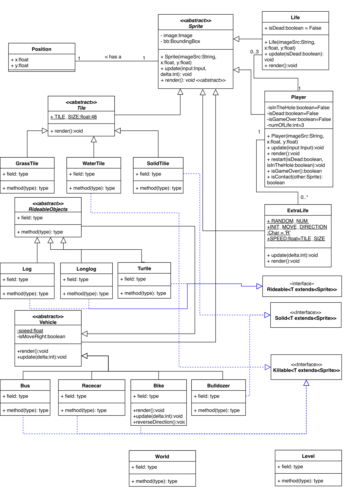

# Shadow Leap
# Introduction
Shadow Leap is a graphical arcade game  project for the subject SWEN20003 Objected Oriented Software Development in 2018 semester 2.

# Usage
  - Require JDK of version 8.
  - Open the software with Intellij Idea or Eclipse. 

# File Structure

# Design in UML

